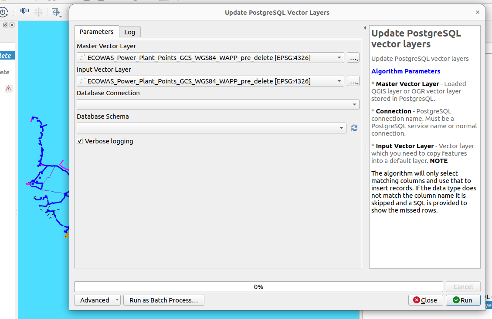
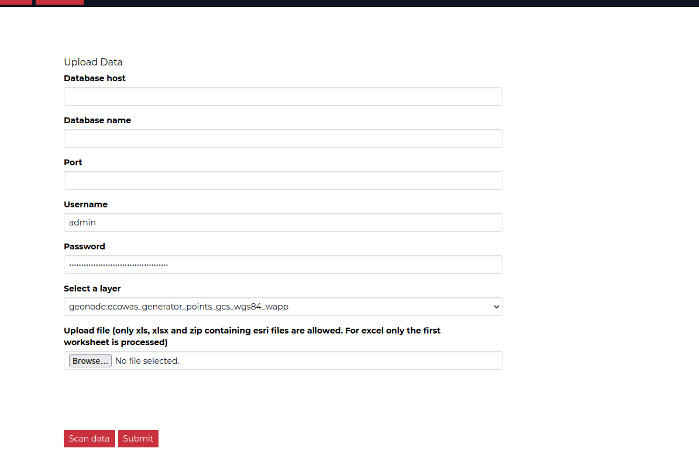
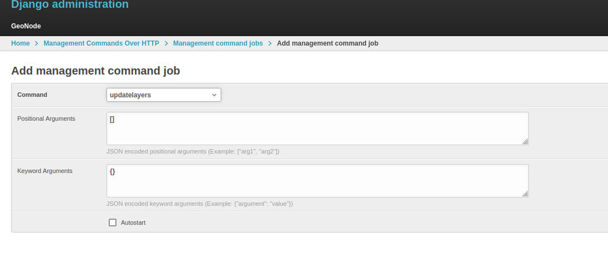

# Woolpert

The project is a GeoNode deployment with a core focus on managing infrastructure data.

## Repository Structure

1) Styles - This will store all the `SLD`, `CSS` styles that will be used by GeoServer.
2) Scripts - All scripts that can be run after deployment or during initialisation of the cluster.
3) Deployment - This stores all files and instructions relation to the deployment. The actual
Kubernetes manifest will not reside here.

   
# Populating Default GeoNode

# Database Model and architecture

The project focused on creating a database that ir normalised to facilitate data capture.
The structure of the current database can be viewed by inspecting the `database-model/index.html`.
This can be opened directly in a browser using either firefox or google chrome.

*TODO:* Describe in detail the data modelling.

## Loading Historic Data

1) Download historic data from the client.
2) Load the data into QGIS.
3) Clean the data ensuring that it adheres to the new model.
**NB** A template Geopackage database is provided to allow ease of data capture.
4) Copy the data from the historic layer and paste the contents into the new layer. Fix any issues 
you might encounter due to the Foreign Key relationships.
5) Alternatively use the script `scripts/bulk_upload.py` in the processing to load data.

# Uploading Data using QGIS Processing Framework
1) Download the script `bulk_upload.py` in the scripts folder.
2) Navigate to QGIS and choose the processing model > scripts.
3) Choose create script option.
4) In the editor that shows up, choose open script and save the script.
5) Choose the script and run following the options defined in the help menu.

6) Run the script and observer the results in the database.


# Uploading (new and historical) data using GeoNode
1) Log into GeoNode instance.
2) Click on "Profile"
3) Select upload
4) The upload form comes up and a user should fill the form appropriately.

5) Scan the data to check for any errors and if none exist, submit.
6) Visualize the results in GeoNode. If the layer extent does not immediately 
change, give it a couple of seconds before refreshing the page again.
**Note:** The upload assumes a user has already downloaded the `geopackage` template
which contain the structure of the tables and the relationship. Only admins can
upload data into the system.

## Populating GeoServer and GeoNode
Once the data is in the database, it is now ready to be visualized on the platform.
The procedure outlined below is a once off process which has already been done
but we provide instructions for future use.

1) Download the script `populate_geoserver.py`
    ```bash
    python3 deployment/populate_geoserver.py
    ```

    To populate the GeoServer instance with layers you have registered in the database.
    **Note** The script assumes you have installed a couple of python packages:

    ```bash
    pip3 install geoserver-rest
    pip3 install requests
    ```

2) Login to the GeoNode instance and navigate to the admin interface or access the page [Admin commands](https://S{SITE_URL}/admin/management_commands_http/) directly.
3) Setup a management job to update the layers in the GeoNode so that they can be visible in GeoNode.

4) Run the job and then inspect the layers in GeoNode.

